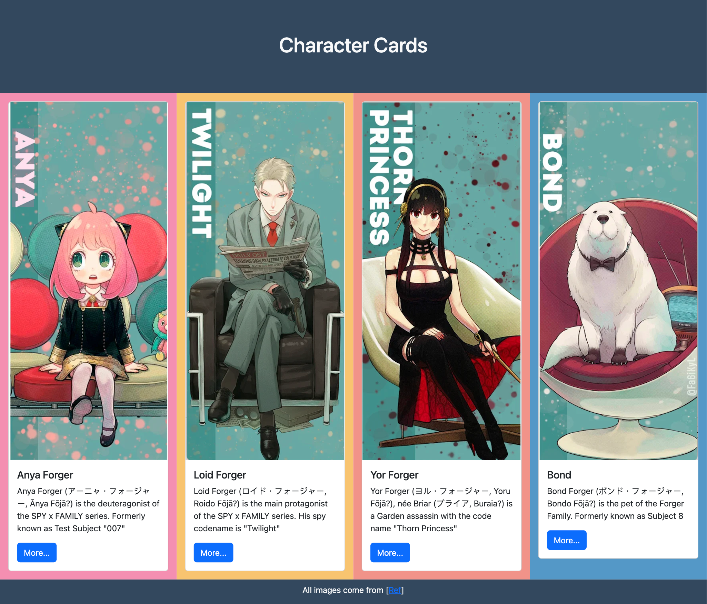

# Faculty of Information and Communication Technology   ITCS223 Introduction to Web Development    Cascading Style Sheet

## Instructions:
- This exercise consists of one task related to basic CSS framework for creating a responsive layout with **Bootstrap** and its components
- No submissions are required. This is for an extra practice.

---

## Direction:

The Bootstrap Framework automatically supports Responsive Web Design and Mobile-first design. It provides many classes and components to make building responsive web pages easier.

This exercise will help you practice using the Bootstrap Framework for layout with **Container** and **Grid**, and the **Card** component [[ref]](https://getbootstrap.com/docs/5.3/components/card/). 
To use the Bootstrap framework to create a page, you should: 
* Use Starter Template to create a structure of the web page  [[ref]](https://getbootstrap.com/docs/5.3/getting-started/introduction/)
* Include a `header`, `main` content, and `footer`, following the principles of the **container** layout[ref](https://getbootstrap.com/docs/5.3/layout/containers/) and **grid** [[ref]](https://getbootstrap.com/docs/5.3/layout/grid/) 
  **Hint**: 1 row should have 4 columns
* Each grid column must have a Bootstrap **Card** component [[ref]](https://getbootstrap.com/docs/5.3/components/card/). The Bootstrap Card can have any type of content.

**Example output**

**Example output when the screen is small**

---

## Submission
No submissions are required. This is for an extra practice.
However, you can still submit (commit) the `html` file.
